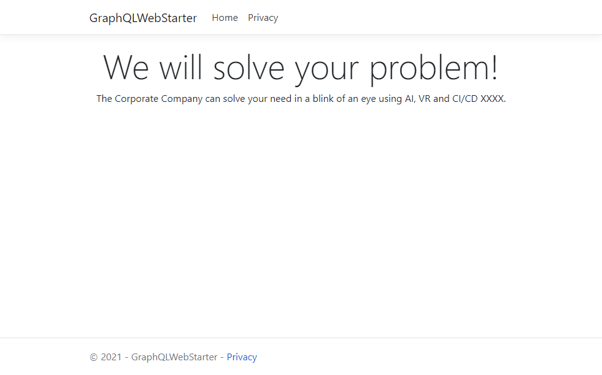

# GraphQL Kontent Starter

## Get started

### Prerequisites

* [Node.js](https://nodejs.org/en/)
* [Dotnet 5.0](https://www.microsoft.com/net/download/core)

### Generate models

1. Enter the project to directory (with `package.json` file)
1. Install dependencies

    ```sh
    npm i
    ```

1. Run the application

   ```sh
   npm run generate:models
   ```

### Start

> You need to [generate models first](#generate-models).

1. Enter the project toot directory (with `GraphQLWebStarter.sln` file)
1. build solution

    ```sh
    dotnet build
    ```

1. Run the application

   ```sh
   dotnet run --project ./GraphQLWebStarter
   ```

### Tests

1. Enter the project toot directory (with `GraphQLWebStarter.sln` file)
1. build solution

    ```sh
    dotnet build
    ```

1. Run all tests

   ```sh
   dotnet test
   ```

## About

All code is in `HomeController` and it is using [`GraphQL.Client` package](https://github.com/graphql-dotnet/graphql-client) and `GraphQL.Client.Serializer.Newtonsoft` for serialization.


